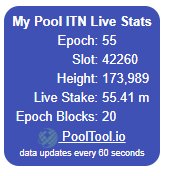

# pooltool.io
A public repo to keep track of issues and feature requests in pooltool

# using sendmytip.sh
let delegators know your pool is online and operating well by sending your nodes blockheights in.  To use grab the sendtips.sh file and edit to include your userid (from the pooltool profile page) and your pool id.

We recommend you send your tips in about once a minute, but no more than once every 20 seconds.  You can setup a cron job that runs once a minute or some people use the `watch` command or even code their looping function to run the script.

Special thank you to Andrea C. of  at [INSL](https://pooltool.io/pool/93756c507946c4d33d582a2182e6776918233fd622193d4875e96dd5795a348c/) for fixing up my initial scripts, creating multi-node versions, and generally maintaining this script. 

# Using ptwidget.html

To get a widget like this on your website, and insert the html into your website page.  Make sure you update the title of the table and your pool id first as well.  Note that the height reported is the PoolTool majority max height, not your own pool's height.  

Note the includes of Jquery and numeral.

If anyone would like to beautify the simple formatting or optimize this as a widget please let me know.

# Using send_slots.sh

You can now submit your upcoming slots to pooltool.  

You have two options:
1.  You can send just your slot count.  This will be displayed along side your epoch blocks in pooltool.
2.  You can send your slot count plus validation for the previous epoch.  If you validate your block count submissions we can then display ACTUAL performance metrics for your pool.  Your data will also be used to develop high level statistics on assignments vs. stake.

There are two methods offered at this time for validation:
1.  You can send your slots encrypted at the start of the epoch along with your slot count.  Then at the start of the next epoch you will send a key to allow us to unencrypt the slots and verify your loaded count matches the actual.

2.  You can send a hash of your leader logs at the start of the epoch along with your slot count. Then at the start of the next epoch you will send us the actual leader logs and confirm the hash matchees what you sent previously.

If the hash or encryption do not match pooltool will not allow you to upload your slots.  Eventually we will implement probation for pools that upload erroneous data.

If something went wrong when validating your slots for the previous epoch, and you want to get slots loaded for the current epoch quickly rather than debug the issue, you can use the smaller send_slots script to manually update your slots in pooltool.  This is meant to be used only for temporary purposes until you get slot validation working.

Remember, the only way we will be able to track your performance is if you send yoru slots in a way we can validate them.

#### when to send your slots
>Setup a crontab task to send your slots at the start of every epoch.  Preferrably in the first 10 minutes of the epoch.  While we will not restrict when you can send slots at the moment, eventually we will to insure pools don't start uploading slots only when they know they will have a good epoch.

Special thank you to Michael at [VIBE](https://pooltool.io/pool/ad67bc523e646aa4acce69c921d47092cb89461f2c6f1252fe6576c280aaa6a8/) for implementing much of this for pooltool. 
